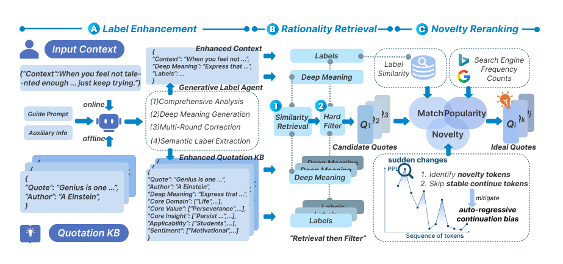

<p align="center">
  
  <a href="https://arxiv.org/abs/2602.22220"></a>
  
</p>

# What Makes an Ideal Quote? Recommending "Unexpected yet Rational" Quotations via Novelty

[English](README.md) | 中文

本工作已被 **ACL 2026 Main Conference** 接收。

> **TL;DR:** 我们提出 NovelQR 用于引据推荐，旨在找到"出人意料但合乎情理"的引据，结合深层含义检索与 Token 级新颖性重排序，提升写作的美学价值。

## 概述

引据推荐旨在通过推荐与上下文互补的引据来丰富写作，然而现有系统大多仅优化表面的主题相关性，忽略了使引据令人难忘的深层语义和美学特性。我们基于两个经验观察：（1）人们一致偏好在语境中"出人意料但合乎情理"的引据；（2）现有强模型难以充分理解引据的深层含义。

我们提出了 **NovelQR**，一个新颖性驱动的引据推荐框架：

- **标签增强**：生成式标签代理将每条引据及其上下文解读为多维深层含义标签，实现标签增强的检索。
- **合理性检索**：检索语义相关的候选引据，并通过深层含义和标签进行过滤。
- **新颖性重排序**：Token 级新颖性估计器对候选引据进行重排序，同时缓解自回归续写偏差。

## 方法



## 项目结构

```
NoQuote/
├── main.py                    # 检索流水线主入口
├── config.json                # 配置文件（API密钥、模型路径）
├── requirements.txt           # Python 依赖
├── run_GPUS.sh                # 多GPU启动脚本
├── code/
│   ├── label_agent.py         # 生成式标签代理
│   ├── retrieval.py           # 检索流水线
│   ├── logit_token_level.py   # Token级新颖性估计器
│   ├── relevance_score.py     # 相关性评分
│   ├── context_summary.py     # 上下文摘要
│   ├── model.py               # 模型工具
│   ├── utils.py               # 通用工具
│   └── rag/                   # RAG 模块
│       ├── rag_module.py
│       ├── rag_retrieval.py
│       ├── rag_add.py
│       └── hard_filter.py
├── data/
│   ├── prompt/                # 提示模板
│   └── quote/                 # 引据数据
└── figure/
    └── method.png
```

## 快速开始

### 安装

```bash
conda create -n NovelQuote python=3.10
conda activate NovelQuote
pip install -r requirements.txt
```

### 下载引据数据

原引据数据来自 [QUILL](https://github.com/GraceXiaoo/QUILL)。经我们 Label Agent 处理后的数据可在 [Hugging Face](https://huggingface.co/datasets/Changpw/Noquote) 获取。请将数据放置在 `data/quote/` 文件夹中。

### 配置

在 `config.json` 中设置：

| 参数 | 说明 |
|---|---|
| `API_KEY` | GPT-4o 的 API 密钥（用作标签代理） |
| `BASE_MODEL` | 本地骨干模型路径（推荐 Qwen3-8B） |
| `EMD_MODEL` | Embedding 模型路径 |

### 运行检索流水线

8卡 GPU 批量推理 + KVCache 部署：

```bash
bash run_GPUS.sh
```

<!-- ## 引用

如果您觉得本工作有帮助，请引用：

```bibtex
@inproceedings{zhang2026noquote,
      title={What Makes an Ideal Quote? Recommending "Unexpected yet Rational" Quotations via Novelty},
      author={Bowei Zhang and Jin Xiao and Guanglei Yue and Qianyu He and Yanghua Xiao and Deqing Yang and Jiaqing Liang},
      year={2026},
      booktitle={Proceedings of the 64th Annual Meeting of the Association for Computational Linguistics (ACL 2026)},
      url={https://arxiv.org/abs/2602.22220},
}
``` -->

## 许可证

本项目采用 MIT 许可证。详见 [LICENSE](LICENSE)。
